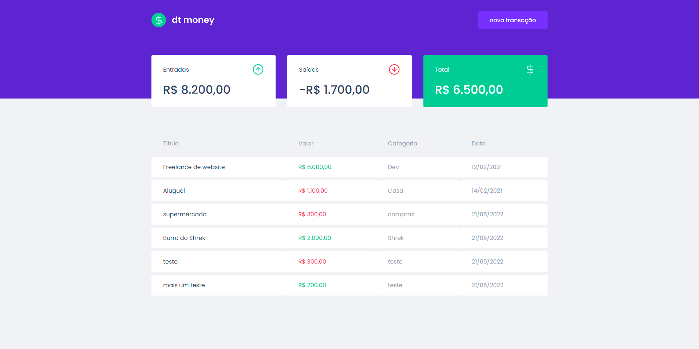

<h1 style="text-align: center; font-weight: bold;">dtMoney</h1>

<h1 align="center">
    
</h1>


### 🎲 Rodando o projeto

```bash
# Instale as dependências
$ yarn install
# ou
$ npm install

# Execute a aplicação
$ yarn dev
# ou
$ npm run dev
```
